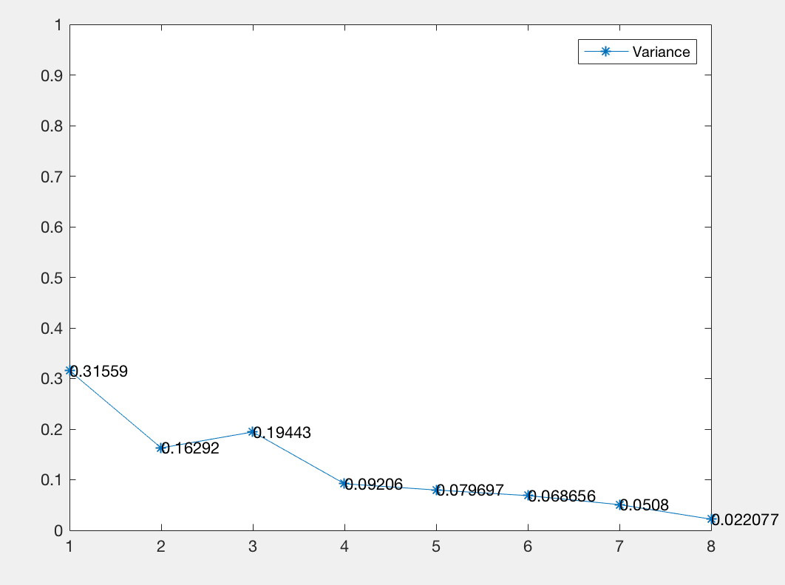

#HW1

### 王晶 16340217

## Exercise 1

首先使用均匀分布产生随机数，产生 *x* 轴上位于 **[0, 1]** 区间，*y* 轴上位于 **[0, 1]** 区间的点。


上图从左到右分别是采样次数N = 20, 50, 100, 200, 300, 500, 1000, 5000时，所计算得到的pi值。

#### 当每个采样点次数重复20次后，得到的均值方差如下：

|采样点数|20|50|100|200|300|500|1000|5000|
|:--:|:--:|:--:|:--:|:--:|:--:|:--:|:--:|:--:|
| 均值 |3.02|3.124|3.226|3.145|3.202|3.108|3.157|3.142|
| 方差 |0.31559|0.16292|0.19443|0.09206|0.079697|0.068656|0.0508|0.022077|

#### 分析
可以看出，均值随着采样点的增加，逐渐地趋于平稳，而方差则随着采样点地增加而减小。

#### 核心代码：


```matlab
my_pi = zeros(8,22);
N = [20, 50, 100, 200, 300, 500, 1000, 5000];
t = [1,2,3,4,5,6,7,8];

for i=1:8
    for j=1:20
        rng('shuffle');%初始化随机发生器
        x = rand(1,N(i));%二维样本的x坐标，x: [-1,1]
        rng('shuffle');%再次初始化随机发生器，与上次不同，将产生独立的随机数
        y = rand(1,N(i));%二维样本的y坐标, y:[-1:1]
        s = sum(x.^2+y.^2 <= 1); %计算落在单位圆内的点数
        my_pi(i,j) = s/N(i)*4; %计算pi值
    end

end

for i=1:8
    my_pi(i,21) = mean(my_pi(i,1:20)); %均值
    my_pi(i,22) = sqrt(sum((my_pi(i,1:20)-my_pi(i,21)).^2)/20); %方差
end

```


#### 当每个采样点次数重复20次后，得到的均值方差如下图：

##### 均值：


 
##### 方差：



----

## Exercise 2

我认为应该采用**均匀分布**的随机采样来获取 *x* 的值
 
 


上图从左到右分别是采样次数N = 5, 10, 20, 30, 40, 50, 60, 70, 80, 100时，所计算得到的积分结果，**可以看出积分结果在采样点非常少的时候，很不理想，误差非常大，但随着采样点数量增加，效果有所好转**

 
#### 当每个采样点次数重复100次后，得到的均值方差如下：


|采样点数|5|10|20|30|40|50|60|70|80|100|
|:--:|:--:|:--:|:--:|:--:|:--:|:--:|:--:|:--:|:--:|:--:|
|均值|0.2548|0.23661|0.25336|0.25163|0.25001|0.24753|0.25038|0.25598|0.25032|0.25248|
|方差|0.19566|0.087164|0.077677|0.058787|0.052641|0.10227|0.06277|0.034286|0.032776|0.041445|

#### 核心代码：

```matlab
a = 0;
b = 1;
N = [5, 10, 20, 30, 40, 50, 60, 70, 80, 100];
xAxis = 1:10;
ans = zeros(10,102);


for i=1:10
for k=1:100
t = rand(1,N(i));
x = a+(b-a)*t;
s = sum(monte_carlo_f(x));
ans(i,k) = s*(b-a)/N(i);
end

ans(i,101) = mean(ans(i,1:100));
ans(i,102) = sqrt(sum((ans(i,1:100)-ans(i,21)).^2)/100);

end
```

这是通过平均值法实现的，除此之外还可以使用随机点法来实现


#### 通过直方图显示：

 

 
 
 


---

## Exercise 3

对于积分：


首先，我认为**无法通过公式直接求解积分*，并且我认为可以使用**均匀分布**随机采样来获取点 *(x, y)*

下图从左到右分别是采样次数N = 10, 20, 30, 40, 50, 60, 70, 80, 100, 200, 500时，所计算得到的积分。


可以发现当取样点非常小的时候，例如只有10个或者20个的时候，会造成非常大的误差，而图中显示当取样点为10或20个的时候，甚至出现的积分为0的情况，因此，少量样本的情况下，**积分结果并不理想**。

具体原因可以看下面的图和分析。


#### 对每个采样点次数重复100次后，得到的均值方差如下：

|采样点数|10|20|30|40|50|60|70|80|100|200|500|
|:--:|:--:|:--:|:--:|:--:|:--:|:--:|:--:|:--:|:--:|:--:|:--:|
|均值|118400|104000|117333|130400|124800|105600|108342|113200|102720|119520|113024|
|方差|245796.6639|160798.0099|229767.0318|142884.5688|92079.9652|70754.6622|90394.1483|61838.4993|101848.515|84102.7942|24770.5632|


#### 核心代码：


```matlab
a=2;
b=4;
c=-1;
d=1;
N = [10, 20, 30, 40, 50, 60, 70, 80, 100, 200, 500];
ans = zeros(11,102);
zMax = 800000;
xAxis = 1:11;


for i=1:11 %11种取样次数

for k=1:100 %重复100次
rng('shuffle');
xff = a+(b-a).*rand(1,N(i));
rng('shuffle');
yff = c+(d-c).*rand(1,N(i));
rng('shuffle');
zff = zMax.*rand(1,N(i));

for j=1:N(i)
    s(j) = monte_carlo_f2(xff(j),yff(j)); 
end
ratio = sum( zff <= s) / N(i);
ans(i,k) = ratio*2*2*800000;

end
end

for i=1:11
    ans(i,101) = mean(ans(i,1:100));%计算均值
    ans(i,102) = sqrt(sum((ans(i,1:100)-ans(i,21)).^2)/100);%计算方差
end
```


然后通过`Matlab`的`integral2()`函数来计算真实的积分结果:


#### 分析

可以发现所求出的均值大多在110000左右，与通过内置函数计算出的正确结果相近，而方差也随着采样点的增加而有逐渐减小的趋势


#### 均值和方差的柱状图


下图是单次取样500个点进行蒙特卡洛法求积分的结果，可以看到函数 *f(x, y)* 所表示的曲面


可以发现当 *x* 在区间**[2, 4]**上，*y* 在区间**[-1, 1]**上的时候，*z*的取值在大部分情况下都非常小，因此造成了采样点极少的时候，会出现结果等于0的情况了。

这是我使用随机点法的做法，其实还可以使用平均值法来实现

