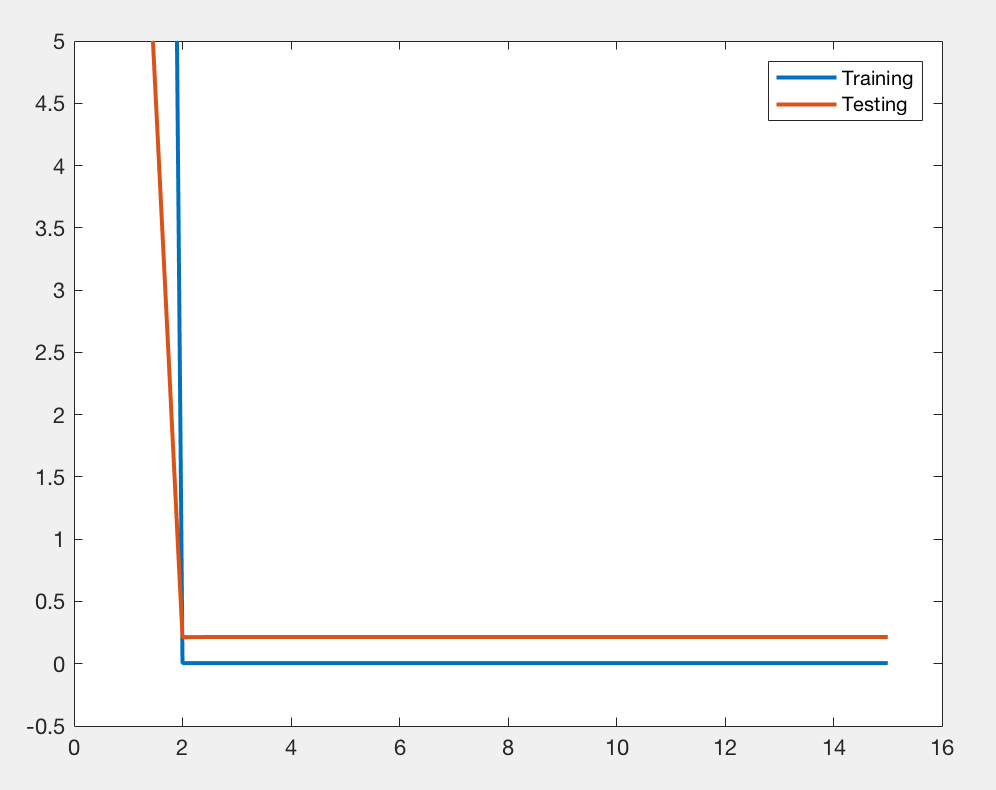
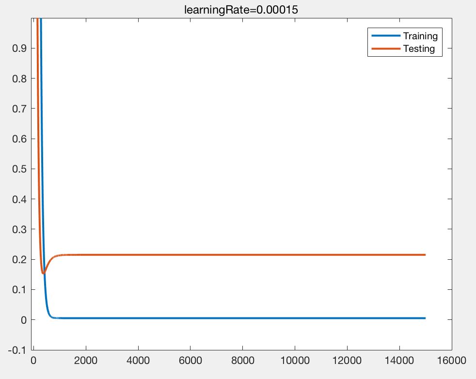
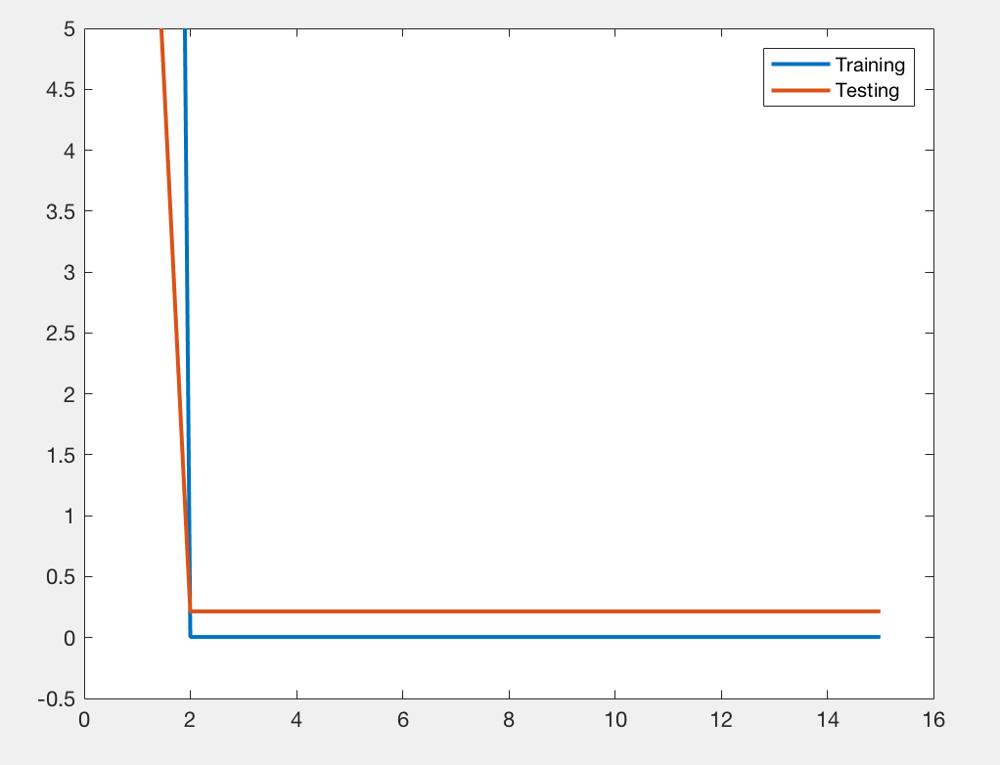
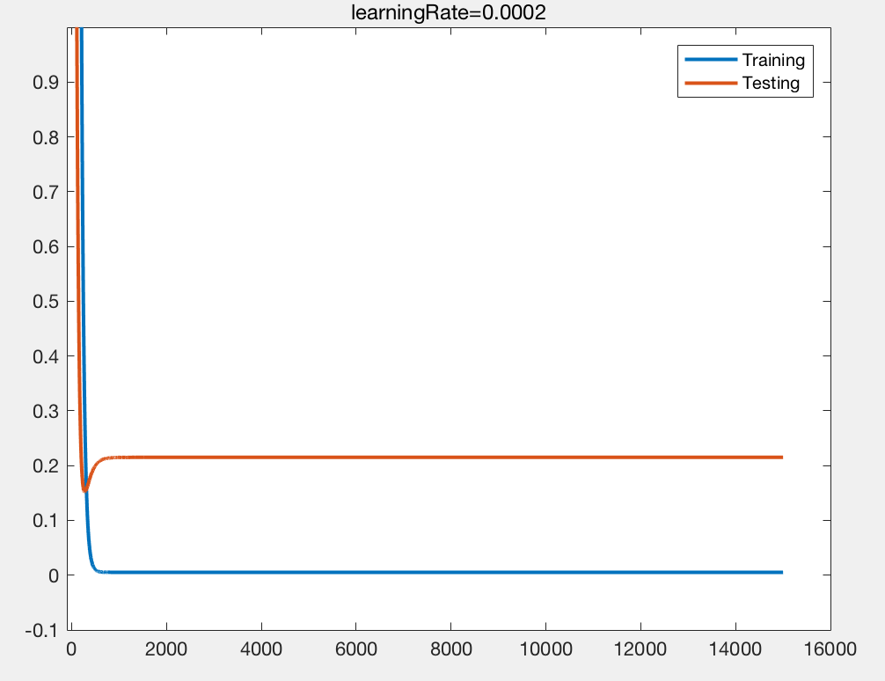
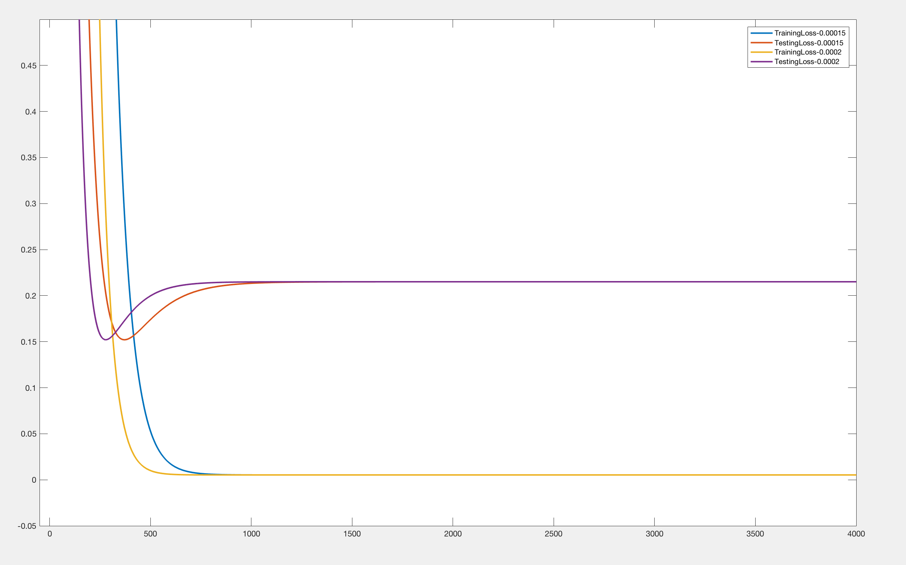
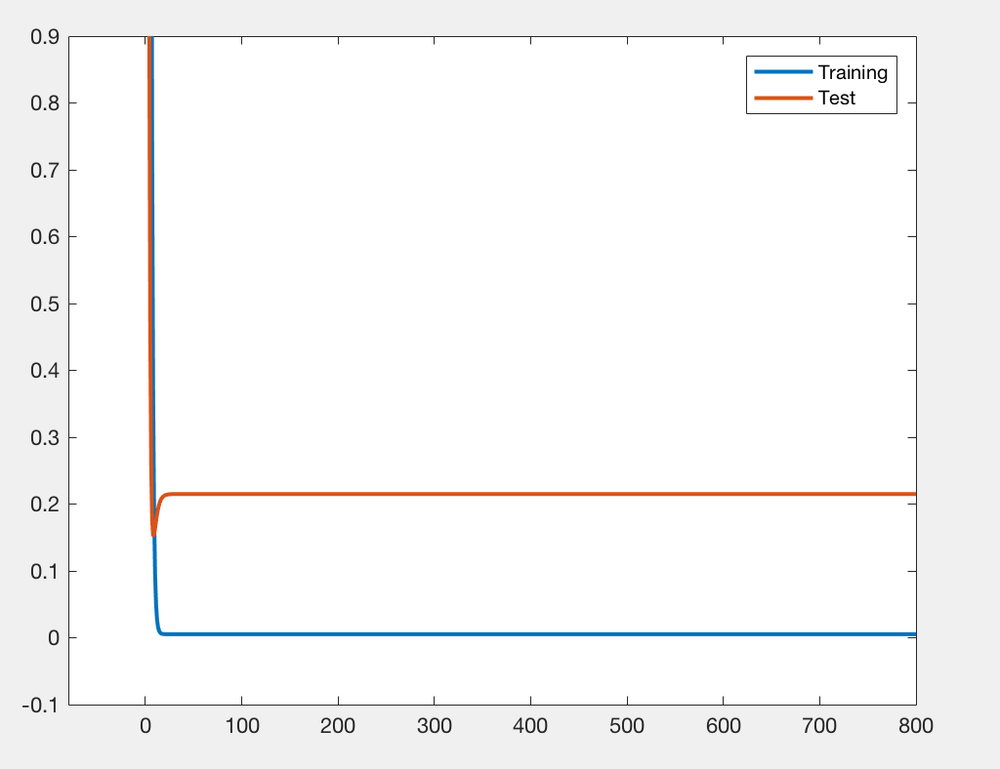
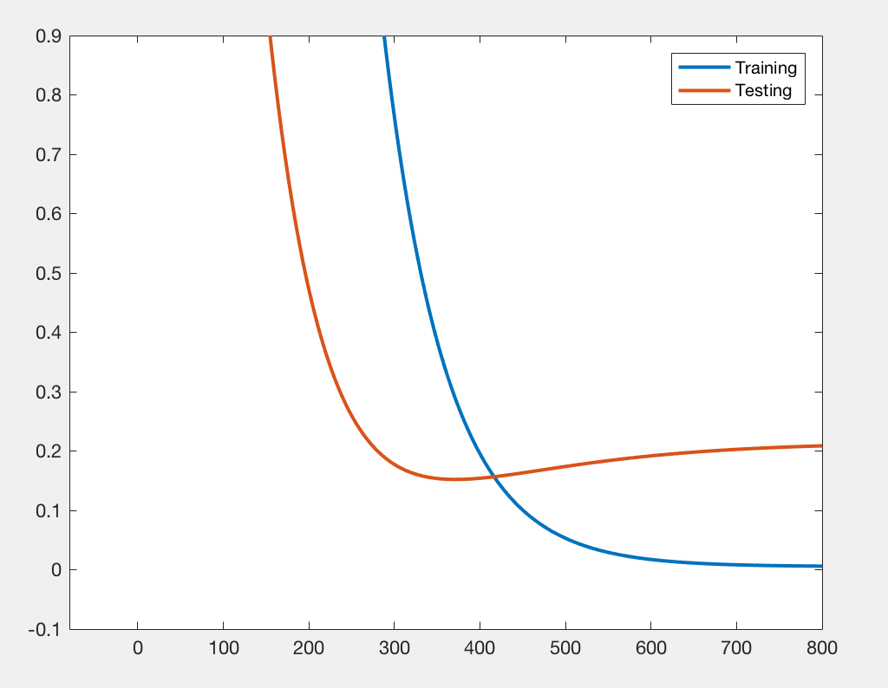
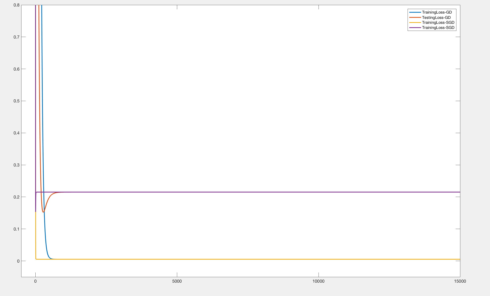

# Homework 2

### 王晶 16340217


## Exercise1

首先我需要使用三个参数，theta1,theta2和theta0

一共迭代150万次，每10万次输出一次训练样本误差和测试样本误差，如图：

### 迭代结果：



但是我觉得K = 10万次太大，得到的信息极其有限，因此我将K调小，令K = 100，即每迭代100次就计算并输出一次误差，希望能够获得更为精确的变化曲线

### 然后得到了下图的结果：



### 我的发现

在观察了输出的结果和绘制的误差曲线之后，可以明显看到误差的变化，总体都在随着迭代次数的增加而减少，然后最后几乎不变，可以发现150万次的迭代次数似乎是有点多的，当然，据我的分析以及同学提供的信息来看，收敛所需要的迭代次数也许和数据是否标准化有关，我第一次没有进行标准化就直接开始迭代的时候，会出现参数过大的情况，导致后来输出结果都是NaN。然后当我将误差计算的次数增加，即减小K之后，我发线测试数据的误差存在一个降低再升高然后稳定的过程，这可能是由于对训练数过拟合导致的。


### 代码如下：

```matlab
function [theta1,theta2,theta0,err,errtest] = myGD( x1,x2,y,test1,test2,testy )
%UNTITLED2 此处显示有关此函数的摘要
%   此处显示详细说明

%梯度下降法,f为目标函数（两变量x1和x2），x为初始点,如[3;4]

x1 = zscore(x1);
x2 = zscore(x2);
y = zscore(y);
test1 = zscore(test1);
test2 = zscore(test2);
testy = zscore(testy);

matx = [x1 x2 [1:50]'];
mattest = [test1 test2 [1:10]'];

maxsteps = 1500000;
learining_rate = 0.00015;

theta2 = 0.0;     % 系数2
theta1 = 0.0;     % 系数1
theta0 = 0.0;     % 常系数

curstep = 0;
step = 0;

err = [];
errtest = [];
count = 1;

 while(curstep<maxsteps)
     curstep = curstep+1;
     step = step+1;
     temp1 = 0;
     temp2 = 0;
     temp0 = 0;

     temp1 = x1'*(matx*[theta1;theta2;theta0] -y);
     temp2 = x2'*(matx*[theta1;theta2;theta0] - y);
     temp0 = sum((matx*[theta1;theta2;theta0]) - y);

     theta1 = theta1 - (learining_rate * temp1/50);
     theta2 = theta2 - (learining_rate * temp2/50);
     theta0 = theta0 - (learining_rate * temp0/50);
     

     if(step==1)
         %loss
        loss_t = sum(((y-matx*[theta1;theta2;theta0]).^2));
        loss_test = sum(((testy-mattest*[theta1;theta2;theta0]).^2));
        err(count) = loss_t;
        errtest(count) = loss_test;
        count = count+1;
     end
     if(step==100)
        step = 0;
     end
 end
 
 plot(1:15000, err, 1:15000, errtest, 'LineWidth',2, 'LineSmoothing', 'on');
 axis([-100 16000 -0.1 1])
 legend('Training','Testing')
 title('learningRate=0.0002')

end


```


## Exercise2

### 当学习率设置为0.0002时，所得到的结果



可以看到总体趋势和学习率为0.00015时相同

### 然后同样缩小K的取值，得到如下结果：



总体来说和学习率为0.00015的时候相同，那么为了看出他们之间的区别，我将他们的结果都绘制在同一幅图上

### 结果如下：




### 我的发现

通过简单的观察输出的前两幅图，可以得到的信息是，学习率增加后没有导致什么错误，也可能是因为增加的幅度不大，增加之后的收敛趋势和测试数据误差的变化趋势都和学习率为0.00015的时候相似，也存在一个降低再升高然后稳定的过程，可能是由于对训练数过拟合导致的。为了详细分析他们之间具体的差异，我将它们绘制在同一个坐标系上，然后可以看到的是，当学习率升高之后，无论是训练数据的误差还是测试数据的误差，收敛速度都更快了


## Exercis3


##### 我认为可以通过随机梯度下降来获得最佳参数

##### 为了能够看出详细的区别，我将**K设为100**，即即每迭代100次就计算并输出一次误差

### 当将方法换成随机梯度下降的时候，通过`axis`来使得图像显示设定的x和y区间的曲线：



### 而同样的坐标系下，同样的K取值下，以及同样的学习率(0.00015)下，exercise1中的结果如下：



### 将两次绘制的曲线叠加：



### 我的发现

一开始的两幅图中可以看出，SGD的收敛速度非常之快，当SGD收敛完成的时候，GD还处于迭代下降的过程，并且误差还比较大，而当我将两幅图的曲线绘制在同一张上的时候，就能明显看出收敛速度的区别了，即可以发现收敛速度提升巨大。

> 随机梯度下降是通过每个样本来迭代更新一次，对比上面的批量梯度下降，迭代一次需要用到所有训练样本（往往如今真实问题训练数据都是非常巨大），一次迭代不可能最优，如果迭代10次的话就需要遍历训练样本10次。但是，SGD伴随的一个问题是噪音较BGD要多，使得SGD并不是每次迭代都向着整体最优化方向。


我的SGD实现代码如下

```matlab
function [ err,errtest ] = mySGD( x1,x2,y,test1,test2,testy )
%UNTITLED 此处显示有关此函数的摘要
%   此处显示详细说明
x1 = zscore(x1);
x2 = zscore(x2);
y = zscore(y);
test1 = zscore(test1);
test2 = zscore(test2);
testy = zscore(testy);

matx = [x1 x2 [1:50]'];
mattest = [test1 test2 [1:10]'];

maxsteps = 1500000;
learining_rate = 0.00015;


theta2 = 0.0;     % 系数2
theta1 = 0.0;     % 系数1
theta0 = 0.0;     % 常系数

curstep = 0;
step = 0;

err = [];
errtest = [];
count = 1;

batch_size = 1;%当其为1时，即是随机梯度下降，否则为minbatch下降

randNum = randperm(50,50);

 while(curstep<maxsteps)
     curstep = curstep+1;
     step = step+1;
     temp1 = 0;
     temp2 = 0;
     temp0 = 0;

     for i=1:batch_size:50
        temp1 = 0;
        temp2 = 0;
        temp0 = 0;
        minibatch = randNum(i);
        for j=1:batch_size
          tempnum = minibatch(j);
          
          temp1 = temp1 + x1(tempnum)*(matx(tempnum,:)*[theta1;theta2;theta0] - y(tempnum));
          temp2 = temp2 + x2(tempnum)*(matx(tempnum,:)*[theta1;theta2;theta0] - y(tempnum));
          temp0 = temp0 + (matx(tempnum,:)*[theta1;theta2;theta0]) - y(tempnum);
        end
        
        theta1 = theta1 - (learining_rate * temp1/batch_size);
        theta2 = theta2 - (learining_rate * temp2/batch_size);
        theta0 = theta0 - (learining_rate * temp0/batch_size);
     end
     
     if(step==1)
         %loss
        loss_t = sum(((y-matx*[theta1;theta2;theta0]).^2));
        loss_test = sum(((testy-mattest*[theta1;theta2;theta0]).^2));
        err(count) = loss_t;
        errtest(count) = loss_test;
        count = count+1;
     end
     if(step==100)
        step = 0;
     end
     
 end
 
 plot(1:15000, err, 1:15000, errtest, 'LineWidth',2, 'LineSmoothing', 'on');
 axis([-80 800 -0.1 0.9])
 legend('Training','Test')
end


```
